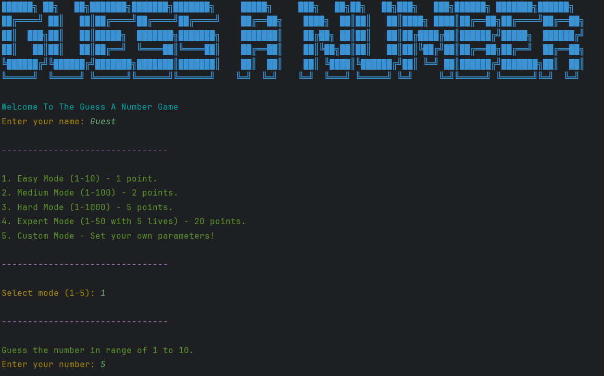

# GuessANumberBySimeon
Python project for Guess a number game

## Overview
The "Guess a Number" game is a simple console-based game where the player attempts to guess a randomly generated number within a specified range. The game offers multiple difficulty levels and allows players to accumulate points based on their performance. Additionally, the game tracks and stores the highest scores across sessions in a persistent leaderboard.

## Features
- **Difficulty Levels:**
  - **Easy Mode:** Guess a number between 1 and 10. Each correct guess awards 1 point.
  - **Medium Mode:** Guess a number between 1 and 100. Each correct guess awards 2 points.
  - **Hard Mode:** Guess a number between 1 and 1000. Each correct guess awards 5 points.
  - **Expert Mode:** Guess a number between 1 and 50 with only 5 lives. Each correct guess awards 20 points.
  - **Custom Mode:** Players can set their own range and number of lives.

- **Persistent Leaderboard:**
  - The game saves the top scores in a leaderboard that persists across different game sessions.
  - Scores are stored in a text file and loaded when the game starts, allowing players to see their ranking over time.

- **Colorful and User-Friendly Interface:**
  - The game uses colored text to enhance the visual experience.
  - Clear instructions and prompts guide the player throughout the game.

## How to Play

1. **Starting the Game:**
   - When the game begins, the player is greeted with a welcome message and asked to enter their name.
   - The player selects a difficulty mode by entering a number corresponding to the mode they wish to play.

2. **Game Mechanics:**
   - The game generates a random number within the selected range.
   - The player inputs their guess and receives feedback on whether their guess was too high, too low, or correct.
   - In Expert and Custom modes, the player has a limited number of lives. If they run out of lives before guessing correctly, the game ends.

3. **Winning and Scoring:**
   - If the player correctly guesses the number, they earn points based on the difficulty mode.
   - After each game session, the player's score is compared to the existing leaderboard, and the leaderboard is updated if the score is among the top.

4. **Playing Again:**
   - After a game session, the player is given the option to play again. If they choose to continue, they can select a new difficulty mode and try to beat their previous score.

5. **Ending the Game:**
   - The game ends when the player chooses not to play again. The final score is displayed, along with the current leaderboard rankings.

## Leaderboard
- **Storage:** The leaderboard is stored in a file named `leaderboard.txt`.
- **Format:** Each line in the file contains the player's name and their score, separated by a colon (e.g., `PlayerName:100`).
- **Updating:** After each game session, the leaderboard is updated if the player's score is higher than existing scores. The leaderboard is then saved back to the file.

## Code Structure

1. **Imports:**
   - The game uses Python's `randint` function from the `random` module for generating random numbers.

2. **Color Codes:**
   - Color codes are defined to make the game's text output more engaging.

3. **Main Game Loop:**
   - The core gameplay is implemented within a loop that continues until the player chooses to quit.

4. **Functions:**
   - **`load_leaderboard()`**: Loads the leaderboard from the file.
   - **`save_leaderboard(leaderboard)`**: Saves the updated leaderboard to the file.
   - **`display_leaderboard(leaderboard)`**: Displays the leaderboard to the player.

## Example Output

